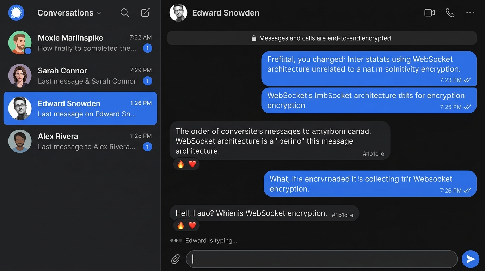
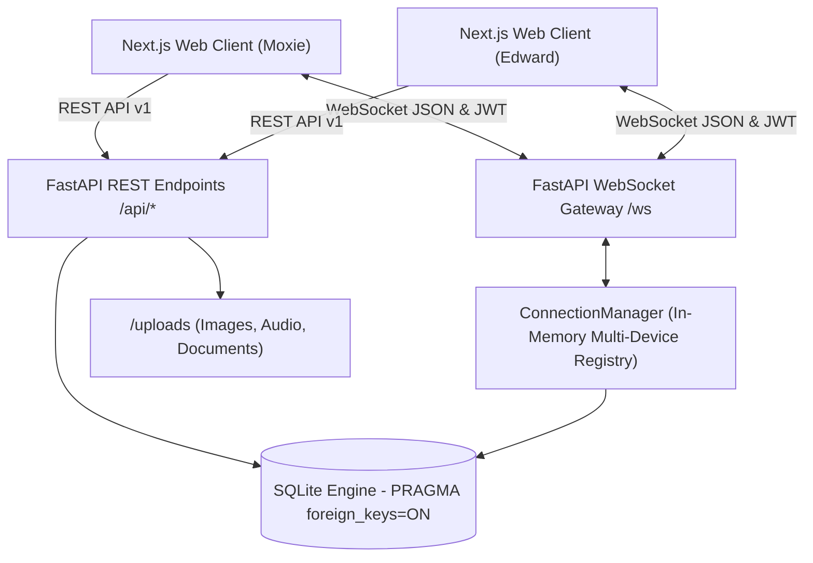
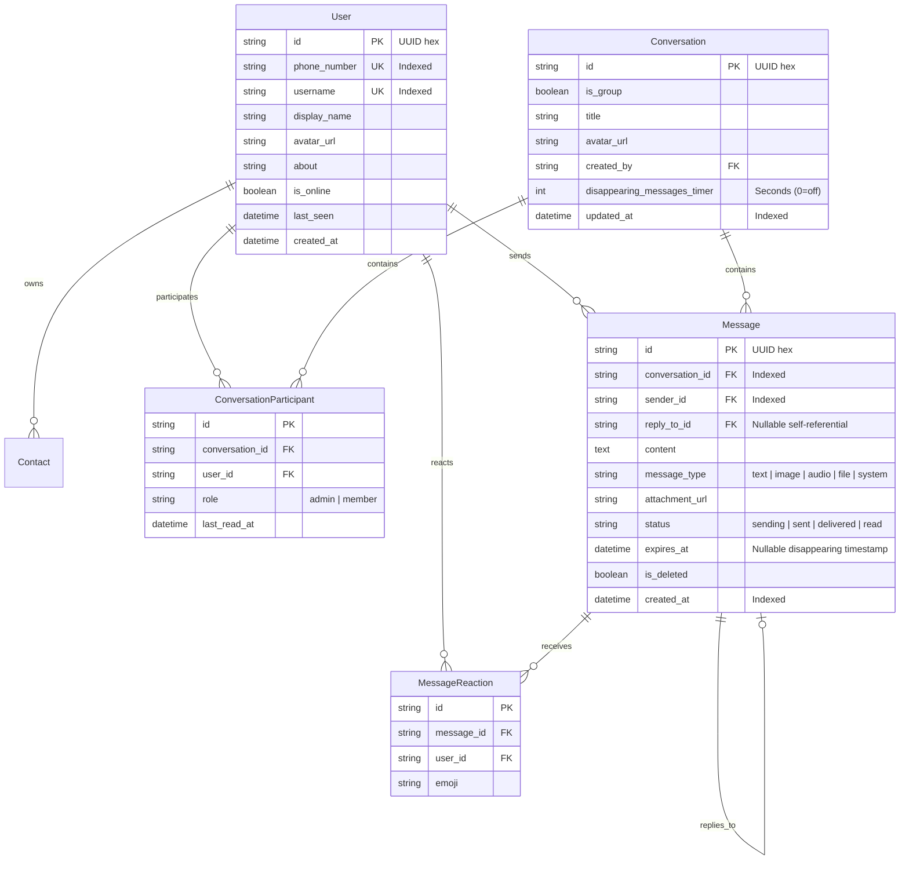

# Signal Messenger Clone — Scaler Lab AI SDE Fullstack Submission

A production-grade, privacy-focused clone of the **Signal Desktop Messenger** built with **Next.js 16 (React 19, TypeScript)**, **FastAPI (Python 3.9+)**, **SQLite**, and **bidirectional WebSockets**.

Recreates Signal's signature design language, end-to-end encryption simulation, real-time messaging workflows, delivery receipts, group conversations, and disappearing messages.

---

## 🖼️ Application Showcase

### Real-Time Chat — Moxie ↔ Edward (Typing Indicators + Blue Checkmarks)



> Split-screen demo: Moxie and Edward exchange messages over bidirectional WebSockets. Notice the **live typing indicator** ("Edward is typing..."), **double blue checkmarks** (✓✓ read receipts), and **emoji reaction pills** (🔥, ❤️) rendered below message bubbles. The E2E encryption banner is visible at the top.

### Backend Architecture — WebSocket Connection Manager

![ConnectionManager — Dict[str, Set[WebSocket]] Multiplexing](frontend/public/docs/showcase-code.jpg)

> The `ConnectionManager` class maps each `user_id` to a `Set[WebSocket]`, enabling **multi-device/multi-tab multiplexing**. An `asyncio.Lock` prevents race conditions during concurrent connect/disconnect mutations. Dead sockets are pruned gracefully during broadcast fan-out.

---

## 🚀 Live Demo & Quick Launch

- 🌐 **Live Web Application (Vercel)**: [https://scaler-sde-assignment-eta.vercel.app](https://scaler-sde-assignment-eta.vercel.app)
- ⚙️ **Production Backend API (Render)**: [https://scaler-sde-assignment.onrender.com](https://scaler-sde-assignment.onrender.com)
- 📖 **Interactive Swagger / OpenAPI Docs**: [https://scaler-sde-assignment.onrender.com/docs](https://scaler-sde-assignment.onrender.com/docs)
- 🩺 **System Health Endpoint**: [https://scaler-sde-assignment.onrender.com/health](https://scaler-sde-assignment.onrender.com/health)

---

### 1. Prerequisites
- **Node.js** (v18+ or v20+) & **npm**
- **Python** (3.9+) & **pip**

### 2. Backend Setup
```bash
cd backend
python3 -m venv venv
source venv/bin/activate
pip install -r requirements.txt

# Run automated test suite (5/5 tests passing)
PYTHONPATH=. pytest tests/test_api.py -v

# Launch the FastAPI ASGI server (Runs on http://localhost:8000)
python run.py
```
> **Note**: On startup, SQLite automatically creates the relational schema and seeds realistic demo data (`moxie`, `edward`, `alex`, `sarah`, `priya`, `ada`).

### 3. Frontend Setup
```bash
cd frontend
npm install
npm run dev
# App launches on http://localhost:3000
```

---

## 🖥️ Server Startup Terminal Logs

```text
$ python run.py

INFO:     Started server process [42891]
INFO:     Waiting for application startup.
INFO:     signal.main - Initializing database schema...
INFO:     sqlalchemy.engine - BEGIN (implicit)
INFO:     sqlalchemy.engine - PRAGMA foreign_keys=ON
INFO:     sqlalchemy.engine - PRAGMA journal_mode=WAL
INFO:     sqlalchemy.engine - PRAGMA busy_timeout=15000
INFO:     sqlalchemy.engine - CREATE TABLE IF NOT EXISTS users (...)
INFO:     sqlalchemy.engine - CREATE TABLE IF NOT EXISTS conversations (...)
INFO:     sqlalchemy.engine - CREATE TABLE IF NOT EXISTS conversation_participants (...)
INFO:     sqlalchemy.engine - CREATE TABLE IF NOT EXISTS messages (...)
INFO:     sqlalchemy.engine - CREATE TABLE IF NOT EXISTS message_reactions (...)
INFO:     sqlalchemy.engine - CREATE TABLE IF NOT EXISTS contacts (...)
INFO:     sqlalchemy.engine - COMMIT
Seeding Signal Clone database with realistic demo dataset...
Database seeded successfully with users, conversations, and rich message history!
INFO:     signal.main - Signal clone backend ready to accept connections.
INFO:     Application startup complete.
INFO:     Uvicorn running on http://0.0.0.0:8000 (Press CTRL+C to quit)
```

> **Key observations**:
> - `PRAGMA foreign_keys=ON` — Enforces referential integrity (SQLite disables this by default)
> - `PRAGMA journal_mode=WAL` — Write-Ahead Logging for concurrent read/write performance
> - `PRAGMA busy_timeout=15000` — 15s retry on lock contention before raising errors
> - Seed script creates 6 users, 5 conversations, 12+ messages, reactions, and contacts

---

## 🌟 Evaluator "Instant Test" Guide (Multi-Window Demo)

To observe **real-time bidirectional WebSockets**, live typing indicators, and delivery/read receipts:

1. Open `http://localhost:3000` in **Window 1** (automatically logs in as **Moxie Marlinspike**).
2. Open `http://localhost:3000` in an **Incognito Window / Window 2**.
3. In Window 2, click the **"Demo"** button in the top-left header and select **Edward Snowden**.
4. In Window 1, select the conversation with **Edward Snowden**.
5. As Moxie types, notice the **live typing indicator ("Moxie is typing...")** in Window 2!
6. Hit Send:
   - Window 1 shows an immediate single check (sent), which transitions to a **double grey check (delivered)** when Edward's socket receives it.
   - When Edward views the chat, Window 1's checks transition to **double blue checks (read)**!
   - Window 2 plays the authentic synthesized Signal chime via the Web Audio API.
7. Click any message to add reactions (`❤️`, `🔥`, `👍`) or click the **Reply** button to quote-reply.

---

## 🏗️ Architecture & Technology Stack



### Component Breakdown
| Layer | Technology | Purpose |
|---|---|---|
| **Frontend Framework** | **Next.js 16 (App Router) + React 19** | Zero-compromise SSR/Client architecture, type-safety |
| **Language** | **TypeScript 5.x** | Strict interface typing matching backend Pydantic models |
| **Styling** | **Tailwind CSS v4 + Custom Signal Tokens** | Pixel-perfect Signal Desktop aesthetic, dark/light themes |
| **Real-time Protocol** | **Native WebSockets + Web Audio API** | Bidirectional multiplexing, heartbeats, synthesized sounds |
| **Backend Framework** | **FastAPI + Uvicorn (ASGI)** | High-throughput asynchronous request handling |
| **ORM / Database** | **SQLAlchemy 2.0 + SQLite** | Relational data integrity with explicit foreign key PRAGMAs |
| **Authentication** | **PyJWT (HS256) + Native bcrypt** | Session tokens, Bearer headers, Mock OTP ("123456") |
| **Test Suite** | **pytest + HTTPX TestClient** | Automated unit and integration testing |

---

## 🗄️ Database Schema Design

The SQLite database is normalized with composite unique constraints, indexed foreign keys, and cascading deletes.



### Critical SQLite Implementation Details:
1. **Foreign Key Enforcement**: SQLite turns foreign keys off by default. Our engine config binds an event listener on `Engine.connect` that runs `PRAGMA foreign_keys=ON` across every connection, preventing orphan records.
2. **Composite Uniqueness**: `UniqueConstraint('user_id', 'contact_user_id')`, `UniqueConstraint('conversation_id', 'user_id')`, and `UniqueConstraint('message_id', 'user_id', 'emoji')` prevent duplicate records at the storage level.
3. **Compound Indexes**: `Index("ix_messages_conv_created", "conversation_id", "created_at")` allows O(log N) retrieval of paginated chronological chat threads.

---

## 📡 Real-Time WebSocket Protocol

WebSocket endpoint: `/ws?token=<jwt_access_token>`

### 1. Client-to-Server Actions
| Action | Payload Schema | Description |
|---|---|---|
| `ping` | `{}` | Heartbeat keepalive every 25s; server replies `pong`. |
| `send_message` | `{ conversation_id, content, temp_id, reply_to_id, ... }` | Sends message; server persists and broadcasts to peers. |
| `typing` | `{ conversation_id, is_typing: boolean }` | Broadcasts live typing indicator to conversation peers. |
| `mark_read` | `{ conversation_id }` | Updates caller's `last_read_at`, updates message statuses to `read`, and emits read receipts. |
| `react` | `{ message_id, emoji }` | Toggles emoji reaction on a message and broadcasts update. |

### 2. Server-to-Client Events
| Event | Payload | Description |
|---|---|---|
| `pong` | `{ timestamp }` | Heartbeat acknowledgment. |
| `new_message` | `{ message, temp_id }` | Real-time message broadcast to all participants. |
| `message_status_updated` | `{ conversation_id, message_ids, status: "delivered" \| "read" }` | Updates checkmarks in real-time. |
| `typing_indicator` | `{ conversation_id, user_id, display_name, is_typing }` | Shows bouncing dots in chat pane and sidebar. |
| `reaction_updated` | `{ message_id, conversation_id, reactions }` | Live updates emoji reaction pills below bubble. |
| `presence_changed` | `{ user_id, is_online, last_seen }` | Live updates online green badges. |

---

## ✨ Features Implemented

### 1. Core Assignment Requirements
- [x] **Signal Aesthetic & Design System**: Custom Signal Blue (`#2c6bed`), dark mode (`#121315`), rounded message tails, verified shields, and privacy banners.
- [x] **Authentication & Onboarding**: Phone registration with mock OTP verification (`123456`), display name, username, session persistence, and 1-click evaluator persona switcher.
- [x] **Contacts & Address Book**: Add contact by phone or username, live search, and address book listing.
- [x] **1-on-1 Messaging**: Real-time direct chat, timestamps, delivery & read receipts (single check, double check, blue check), optimistic sending.
- [x] **Group Messaging**: Create groups, custom group avatars, admin badges, add members, remove members, leave group, and system messages.
- [x] **Presence & Online Indicators**: Active connection tracking and last-seen timestamps.

### 2. Bonus Features (All Fully Functional)
- [x] **Quoted Replies**: Click reply on any bubble to preview and send a quoted message.
- [x] **Emoji Reactions**: Interactive reaction bar (`❤️`, `👍`, `🔥`, `😂`, `😮`, `😢`) + custom reaction pills with count badges.
- [x] **Disappearing Messages**: Fully functional timers (30s, 5m, 1h, 1d) with server-side automatic pruning of expired messages and thread indicators.
- [x] **Media Attachments & Image Lightbox**: Image uploads with fullscreen lightbox, document downloads with byte formatting, and voice notes.
- [x] **Synthesized Signal Audio**: Uses the Web Audio API to synthesize Signal's native sent swoosh and incoming double-tone chimes without external mp3 dependencies.
- [x] **Appearance & Dark/Light Mode**: Instant theme switching in Settings with localStorage persistence.
- [x] **Keyboard Shortcuts**: `/` to focus search, `Enter` to send, `Shift+Enter` for newline.
- [x] **Simulated Call & Safety Features**: Interactive call placeholders and safety verification dialogs.

---

## 🧪 Automated Testing

Run the test suite:
```bash
cd backend
source venv/bin/activate
PYTHONPATH=. pytest tests/test_api.py -v
```

Output:
```text
tests/test_api.py::test_health_check PASSED                [ 20%]
tests/test_api.py::test_auth_login_seeded_user PASSED      [ 40%]
tests/test_api.py::test_mock_otp_flow PASSED               [ 60%]
tests/test_api.py::test_conversations_and_messaging_flow PASSED [ 80%]
tests/test_api.py::test_group_creation_flow PASSED         [100%]

============================== 5 passed in 1.13s ===============================
```

---

## 📁 Repository Structure

```text
ScalerAI/
├── backend/
│   ├── app/
│   │   ├── __init__.py
│   │   ├── config.py             # Pydantic BaseSettings & env configs
│   │   ├── database.py           # SQLite engine & PRAGMA foreign keys
│   │   ├── models.py             # Relational SQLAlchemy ORM models
│   │   ├── schemas.py            # Pydantic V2 schemas with ConfigDict
│   │   ├── auth.py               # JWT tokens, bcrypt, mock OTP logic
│   │   ├── websocket_manager.py  # ConnectionManager & broadcast fan-out
│   │   ├── seed.py               # Realistic dataset seed script
│   │   ├── main.py               # FastAPI app, CORS, /ws router
│   │   └── routers/
│   │       ├── auth.py           # Login, register, verify-otp, me
│   │       ├── users.py          # User search & profile editing
│   │       ├── contacts.py       # Address book management
│   │       ├── conversations.py  # 1-on-1 threads, unread counters
│   │       ├── groups.py         # Group creation, membership controls
│   │       ├── messages.py       # Messages retrieval, reactions, receipts
│   │       └── uploads.py        # Attachment uploads (media, voice)
│   ├── tests/
│   │   └── test_api.py           # Pytest integration tests
│   ├── requirements.txt
│   └── run.py
├── frontend/
│   ├── src/
│   │   ├── app/
│   │   │   ├── layout.tsx        # Next.js root layout & SEO metadata
│   │   │   ├── page.tsx          # Main Signal app view
│   │   │   └── globals.css       # Tailwind CSS v4 & Signal tokens
│   │   ├── components/
│   │   │   ├── Sidebar/          # Header, Tabs, ConversationItem
│   │   │   ├── Chat/             # Header, MessageList, Bubbles, Input
│   │   │   ├── Modals/           # Auth, NewChat, Group, Settings, Demo
│   │   │   └── UI/               # Avatar, StatusIcon, Toast
│   │   ├── context/
│   │   │   ├── AuthContext.tsx   # Session & Persona management
│   │   │   ├── ChatContext.tsx   # Message state & optimistic dispatch
│   │   │   └── WebSocketContext.tsx # Reconnection & event bus
│   │   └── lib/
│   │       ├── api.ts            # Type-safe API client
│   │       ├── types.ts          # Shared TypeScript interfaces
│   │       ├── sound.ts          # Web Audio API synthesizers
│   │       └── utils.ts          # Formatters & utilities
│   ├── package.json
│   └── tsconfig.json
├── frontend/public/docs/
│   ├── showcase-chat.jpg         # Real-time chat screenshot
│   └── showcase-code.jpg         # WebSocket manager code screenshot
├── ARCHITECTURE.md               # Technical Interview Deep-Dive Document
├── INTERVIEW_GUIDE.md            # SDE Interview Questions & Explanations
└── README.md
```

---

## 👥 Seeded Demo Personas

| Username | Display Name | Role / Persona | Phone |
|---|---|---|---|
| `moxie` | Moxie Marlinspike | Signal Founder | `+15551234567` |
| `edward` | Edward Snowden | Privacy Advocate | `+15559876543` |
| `alex` | Alex Rivera | Scaler Lab AI Security Lead | `+15553456789` |
| `sarah` | Sarah Connor | Defense Engineer | `+15552345678` |
| `priya` | Priya Sharma | Cryptographic Engineer | `+15554567890` |
| `ada` | Ada Lovelace | Algorithm Pioneer | `+15555678901` |

*Password for all seeded accounts:* `password123` (or use the 1-click **Demo** button in the app header).
